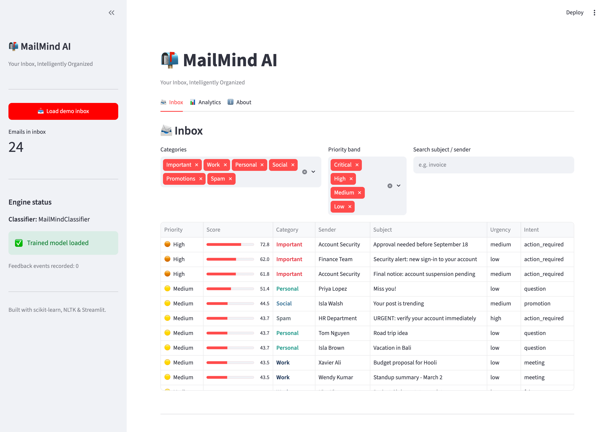
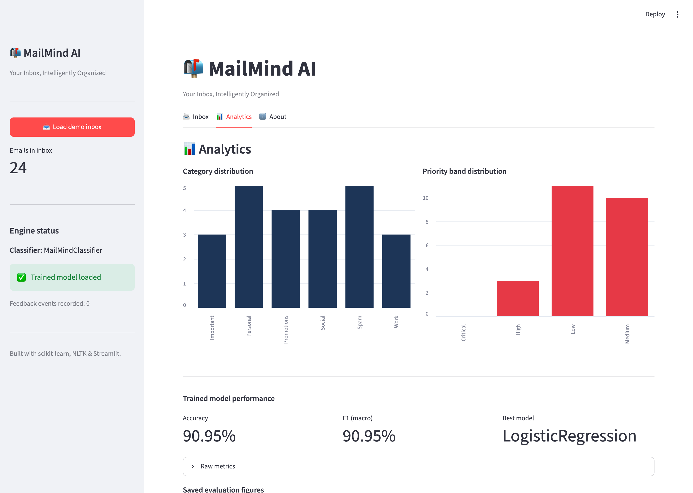

<div align="center">

# 📬 MailMind AI
### *Your Inbox, Intelligently Organized*

An **agentic AI email assistant** that automatically **classifies, prioritises, summarises and acts** on email using NLP, Machine Learning and an autonomous decision layer.

[](https://www.python.org/)
[](https://scikit-learn.org/)
[](https://fastapi.tiangolo.com/)
[](https://streamlit.io/)
[]()
[](LICENSE)

</div>

---

## 1. Project Overview

Knowledge workers receive **120+ emails a day**; the important ones drown in a flood of
newsletters, notifications and spam. **MailMind AI** is a final-year project that tackles
this *cognitive overload* by treating the inbox as a problem an **autonomous agent** can
manage on the user's behalf.

For every incoming message MailMind AI:

1. **Classifies** it into one of six categories — `Important`, `Work`, `Personal`,
   `Social`, `Promotions`, `Spam` — with a calibrated machine-learning model.
2. **Analyses** it with NLP to extract **keywords**, detect **intent**, gauge
   **sentiment** and measure **urgency**.
3. **Scores its priority** by fusing the category, urgency, **sender importance**,
   message **recency** and the user's **past behaviour**.
4. **Acts agentically** — flags what is urgent, writes a one-line **summary**,
   **suggests the next action** (reply, add-to-calendar, unsubscribe, delete…), and
   **adapts over time** from feedback (opened / replied / ignored / deleted).

The result is a **prioritised, self-organising inbox** that reduces cognitive load and
keeps the user focused on what actually matters.

<div align="center">

</div>

---

## 2. Features

| Pillar | What it does |
| --- | --- |
| 🗂️ **Email Classification** | 6-class model (TF-IDF + engineered features) → **90.9 % test accuracy / 0.91 macro-F1** |
| 🧠 **NLP Processing** | Keyword extraction, intent detection, VADER sentiment, rule-based urgency scoring |
| 📈 **Behavioural Intelligence** | Learns per-sender / per-category engagement from open · reply · ignore · delete |
| 🎯 **Contextual Intelligence** | Sender importance (VIP/domain), email recency, historical interactions |
| 🤖 **Agentic Layer** | Autonomously sorts, flags urgent mail, suggests actions, generates summaries, and **adapts** |
| 🔌 **Interfaces** | A **FastAPI** REST service and an interactive **Streamlit** dashboard |
| 💾 **Persistence** | Lightweight **SQLite** store for emails, insights and the feedback log |

### Screenshots

| Prioritised inbox | Analytics & model metrics |
| --- | --- |
|  |  |

---

## 3. Folder Structure

```
MAIN MIND/
├── README.md                  ← this file
├── requirements.txt           ← pip dependencies
├── pyproject.toml             ← packaging + console scripts
├── LICENSE
│
├── data/                      ← generated dataset + sample predictions
│   └── emails.csv             ← 4,200-row synthetic corpus (regenerated)
├── models/                    ← trained model + metrics (regenerated)
│   ├── mailmind_classifier.joblib
│   ├── metrics.json
│   └── model_comparison.csv
├── docs/
│   ├── ARCHITECTURE.md
│   ├── DEPLOYMENT.md
│   ├── FINDINGS.md            ← results & analysis
│   ├── SAMPLE_OUTPUTS.md      ← example predictions
│   ├── MailMind_AI.pptx       ← 14-slide presentation
│   └── screenshots/           ← figures used by the report & deck
│
├── src/mailmind/              ← the Python package
│   ├── config.py              ← all paths, labels, hyper-parameters
│   ├── schema.py              ← Email / NLPSignals / EmailInsight dataclasses
│   ├── utils/text.py          ← NLTK-optional text pipeline
│   ├── data/                  ← synthetic dataset generator + preprocessing
│   ├── ml/                    ← features · classifier · training · evaluation
│   ├── nlp/                   ← keywords · sentiment · urgency · intent
│   ├── behavioral/            ← engagement learner
│   ├── context/               ← priority scorer
│   ├── agent/                 ← orchestrator · summariser · action suggester
│   ├── db/                    ← SQLite persistence
│   ├── api/                   ← FastAPI service
│   └── cli.py                 ← terminal demo
│
├── app/streamlit_app.py       ← dashboard UI
├── scripts/                   ← generate_data · train_model · demo · sample_outputs …
└── tests/                     ← 44 pytest unit/integration tests
```

---

## 4. Installation Steps

> **Prerequisites:** Python **3.9+** and `pip`. (Developed and tested on Python 3.12.)

Run these from a terminal — the whole block is safe to copy-paste:

```bash
git clone <your-repo-url> "MAIN MIND"
cd "MAIN MIND"
python -m venv .venv
source .venv/bin/activate
pip install -e .
pip install -r requirements.txt
python scripts/download_nltk.py
```

1. **Clone & enter** the project folder.
2. **Create and activate a virtual environment** (recommended). On **Windows** use
   `.venv\Scripts\activate` instead of the `source` line.
3. **Install the package** (`pip install -e .` — core deps) **and the full stack**
   (`requirements.txt` — adds the API, UI and plotting libraries).
4. **Download the NLTK corpora** (VADER, punkt, WordNet, stopwords) used by the NLP layer.

The editable install puts the `mailmind` package on your path and registers the
`mailmind-generate`, `mailmind-train` and `mailmind-demo` console commands. If you prefer
**not** to install, prefix every command with `PYTHONPATH=src` instead.

---

## 5. Dependencies

| Layer | Libraries |
| --- | --- |
| **Core ML** | `scikit-learn`, `numpy`, `pandas`, `scipy`, `joblib` |
| **NLP** | `nltk` (VADER, punkt, WordNet), `spaCy` *(optional, auto-detected)* |
| **Backend / API** | `fastapi`, `uvicorn`, `pydantic` |
| **Frontend** | `streamlit`, `altair` |
| **Evaluation / viz** | `matplotlib`, `seaborn` |
| **Testing** | `pytest` |
| **Optional (BERT path)** | `torch`, `transformers` *(commented out in `requirements.txt`)* |

> The code **degrades gracefully**: spaCy, seaborn and the transformer path are all
> optional. The full training + inference pipeline runs on only the core ML + NLTK +
> matplotlib stack.

---

## 6. Running Instructions

All commands are run from the project root. (Add `PYTHONPATH=src` if you skipped
`pip install -e .`.)

**Step 1 — build the dataset, train the model, and try the demo.** Paste this whole
block (it is comment-free, so it copy-pastes cleanly in `bash` *and* `zsh`):

```bash
python scripts/generate_data.py
python scripts/train_model.py
python scripts/demo.py
python scripts/sample_outputs.py
PYTHONPATH=src pytest -q
```

| Command | What it does |
| --- | --- |
| `generate_data.py` | writes the 4,200-email dataset → `data/emails.csv` |
| `train_model.py` | trains 4 models, keeps the best → `models/` + figures in `docs/screenshots/` |
| `demo.py` | prints the agent triaging a sample inbox in your terminal |
| `sample_outputs.py` | writes `docs/SAMPLE_OUTPUTS.md` + `data/sample_predictions.json` |
| `pytest -q` | runs the 44-test suite |

**Step 2 — launch the REST API** (in its own terminal):

```bash
bash scripts/run_api.sh
```

Then open **http://localhost:8000/docs** — the interactive API explorer.
(The bare root `http://localhost:8000/` returns `{"detail":"Not Found"}` by design — a
REST API has no home page; use `/docs`, `/health`, `/process`, etc.)

**Step 3 — launch the dashboard** (in a second terminal):

```bash
bash scripts/run_ui.sh
```

Then open **http://localhost:8501** and click **"Load demo inbox"**.

> **zsh tip:** if you copy a command that still has a trailing `# comment`, your shell may
> treat `#` as an argument (zsh doesn't enable inline comments by default). Either drop the
> comment or run `setopt interactive_comments` once. All blocks above are already
> comment-free.

---

## 7. Dataset Information

Because real labelled inboxes are private, MailMind AI ships a **deterministic synthetic
corpus generator** (`mailmind.data.dataset_generator`).

* **Size:** 4,200 emails — **700 per category**, perfectly balanced.
* **Schema:** `id, sender, sender_name, sender_domain, subject, body, timestamp,
  has_attachment, num_links, label`.
* **Realism:** each category has **14 subject × 14 body** templates with slot-filling
  (names, companies, amounts, dates, OTPs, discount %), category-specific sender domains
  (e.g. `bank.com`, `linkedin.com`, junk `*.xyz`), and realistic metadata
  (Promotions average ~4 links, Work ~60 % attachment rate).
* **Difficulty:** a configurable **ambiguity** fraction (default **12 %**) borrows a
  confusable neighbour's body so the classes are *not* perfectly separable — this is what
  produces the realistic ~91 % accuracy and the interpretable confusion structure
  (Important↔Work, Promotions↔Spam, Social↔Promotions) instead of an artificial 100 %.
* **Reproducible:** identical `seed` ⇒ identical corpus.

```bash
python -m mailmind.data.dataset_generator --samples 700 --seed 42 --ambiguity 0.12
```

---

## 8. Results

Best model: **Logistic Regression** (TF-IDF 1–2-grams + 8 engineered features), selected
by macro-F1 on a stratified 80/20 split (3,360 train / 840 test).

| Metric | Score |
| --- | --- |
| Accuracy | **0.9095** |
| Precision (macro) | 0.9104 |
| Recall (macro) | 0.9095 |
| **F1 (macro)** | **0.9095** |
| F1 (weighted) | 0.9095 |

**Model comparison** (macro-F1): Logistic Regression `0.910` > Linear SVM `0.908` >
Complement NB `0.868` > Random Forest `0.858`.

<div align="center">


</div>

See **[docs/FINDINGS.md](docs/FINDINGS.md)** for the full analysis and
**[docs/SAMPLE_OUTPUTS.md](docs/SAMPLE_OUTPUTS.md)** for example predictions.

---

## 9. API Usage

Start the server (`bash scripts/run_api.sh`) and explore the interactive docs at
`http://localhost:8000/docs`.

| Method | Endpoint | Purpose |
| --- | --- | --- |
| `GET` | `/health` | Liveness + loaded-model info |
| `POST` | `/classify` | Category + class probabilities |
| `POST` | `/analyze` | NLP signals (keywords, sentiment, urgency, intent) |
| `POST` | `/process` | **Full agent insight** for one email |
| `POST` | `/process_inbox` | Prioritised insights for a list of emails |
| `POST` | `/feedback` | Record a user action (drives behavioural learning) |
| `GET` | `/stats` | Aggregate usage statistics |

```bash
curl -X POST http://localhost:8000/process \
  -H "Content-Type: application/json" \
  -d '{"subject":"URGENT: verify your account now",
       "body":"Your account will be suspended. Confirm your password immediately!!!",
       "sender":"security@secure-verify.xyz","num_links":3}'
```

```jsonc
{
  "classification": { "label": "Spam", "confidence": 0.92, "probabilities": { ... } },
  "nlp": {
    "keywords": ["account", "urgent", "verify", "suspended", "password"],
    "sentiment": { "label": "negative", "score": -0.63 },
    "urgency":   { "level": "high", "cues": ["urgent", "immediately"] },
    "intent":    { "label": "action_required", "confidence": 0.71 }
  },
  "priority": { "score": 41.8, "band": "Medium", "reasons": ["High urgency cues", ...] },
  "summary": "Your account will be suspended. Confirm your password immediately.",
  "suggested_actions": [{ "action": "delete", "label": "Delete & block" }],
  "flags": ["urgent", "spam"]
}
```

---

## 10. Future Scope

- 🔗 **Live mailbox integration** via IMAP / Gmail & Microsoft Graph APIs.
- 🧬 **Transformer embeddings** (BERT / sentence-transformers) behind the existing
  feature interface for a further accuracy lift on hard cases.
- ✍️ **Generative replies** — draft context-aware responses with an LLM.
- 👤 **Per-user online learning** so the model personalises continuously, not just the
  priority weights.
- 🌐 **Multilingual** classification and **calendar / task** tool-use by the agent.
- ☁️ **Cloud deployment** (Docker + managed Postgres) with OAuth-based multi-tenancy.

---

## 11. Contributors

| Role | Name |
| --- | --- |
| Developer — NLP · ML · Backend · UI | **Srujana Janga** |
| Guide / Mentor | *[Faculty Guide]* |

> Built by **Srujana Janga**. If this was a team submission, add teammates as extra
> rows (with roll numbers) and fill in the guide placeholder.

---

<div align="center">

*Built with ❤️ using Python, scikit-learn, NLTK, FastAPI & Streamlit.*

</div>
