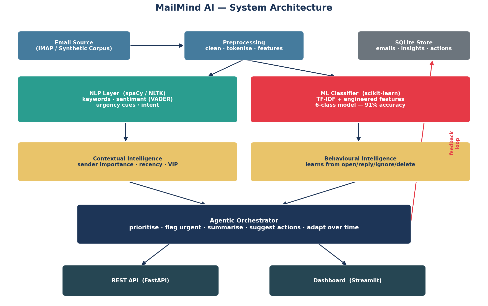

# 🏗️ MailMind AI — Architecture

This document describes the technical architecture of **MailMind AI — *Your Inbox,
Intelligently Organized***: an agentic AI email assistant that classifies, prioritises,
and acts on incoming mail. It is written to be implementation-faithful — every component
named here maps to a concrete module in the `mailmind` Python package.

## 1. Overview

MailMind ingests raw emails and emits, for each one, a single enriched **`EmailInsight`**:
a predicted category, NLP signals (keywords, intent, sentiment, urgency), a 0–100 priority
score and band, an extractive summary, suggested actions, and attention flags (urgent / VIP /
spam / promo). The agent processes an inbox as a batch, returning insights **sorted by
priority**, and learns from user feedback over time.

The system is organised as a layered pipeline. Each email flows through five stages —
ML classification → NLP signal extraction → contextual priority scoring → behavioural
adaptation → agentic output — orchestrated by `mailmind.agent.MailMindAgent` and backed by
a SQLite store.



*Figure 1 — End-to-end MailMind architecture: ingestion, the ML/NLP/context/behaviour
analysis layers, the agent orchestrator, the SQLite persistence layer, and the FastAPI /
Streamlit interfaces.*

## 2. Design Principles

- **Modular.** Each concern lives in its own sub-package (`ml`, `nlp`, `context`,
  `behavioral`, `agent`, `db`, `api`, `app`) with a small public surface. Sub-packages
  depend on `schema` and `config`, not on each other's internals.
- **Dependency-light.** The core runs on the scientific Python stack (scikit-learn, numpy,
  pandas) plus the standard-library `sqlite3`. Heavier or optional dependencies (spaCy,
  FastAPI, Streamlit) are imported lazily and only where used.
- **Graceful degradation.** Every external capability has a fallback. If the trained model
  is missing or the ML stack is unavailable, the agent transparently swaps in the rule-based
  `HeuristicClassifier`. If NLTK resources are absent, `utils/text.py` falls back to a pure-Python
  text pipeline. Optional spaCy noun-phrase extraction is skipped silently when not installed.
- **Deterministic.** The synthetic dataset is generated under a fixed seed (`seed=42`) and
  the text/feature pipeline is reproducible, so training runs and demos yield identical output.
- **Testable.** A suite of **44 pytest tests** (all passing) covers the dataset generator,
  feature builder, classifier, each NLP signal, the scorer, the agent, and the database.

## 3. Data Flow — One Email, End to End

The following walk-through traces a single message from ingestion to agent output. It mirrors
`MailMindAgent.process_email` exactly.

1. **Ingestion / coercion.** A raw input (an `Email`, a `dict`, or a plain string) enters via
   `process_email` / `process_inbox` and is normalised to a canonical `mailmind.schema.Email`
   dataclass through `mailmind.schema.as_email`.
2. **Classification.** `mailmind.ml.classifier.MailMindClassifier.classify(email)` cleans the
   text, builds the combined feature vector, runs the scikit-learn pipeline, and returns a
   `Classification` (label + confidence). When no trained model is available the agent uses
   `HeuristicClassifier` instead.
3. **NLP signal extraction.** `mailmind.nlp.analyze_text(text, email)` bundles four analysers
   — `extract_keywords`, `detect_intent`, `analyze_sentiment`, `detect_urgency` — into one
   `NLPSignals` object (keywords, 7-class intent, VADER sentiment, urgency level).
4. **Contextual priority scoring.** `mailmind.context.ContextScorer.score(email, classification,
   nlp)` combines the category base importance, urgency, sender importance, learned behaviour,
   and freshness into a 0–100 `Priority` (score + band + human-readable reasons).
5. **Behavioural adaptation.** Inside scoring, `mailmind.behavioral.BehavioralLearner` supplies
   per-sender and per-category engagement (derived from past actions) so priority reflects how
   the user has historically treated similar mail.
6. **Agentic output.** `mailmind.agent.summarizer.summarize` produces a 1–2 sentence extractive
   summary; `mailmind.agent.actions.suggest_actions` proposes concrete next steps; and the agent
   derives attention `flags` (`urgent`, `vip`, `spam`, `promo`).
7. **Assembly + persistence.** All of the above are assembled into an `EmailInsight`. If a
   `Database` is configured, the email and its insight are persisted as a side effect.
8. **Batch ordering.** `process_inbox` repeats steps 1–7 for every message and returns the list
   **sorted by `priority.score` descending**, so the most important mail surfaces first.

Feedback closes the loop: `MailMindAgent.record_feedback(email, action)` logs the user's action
(replied / opened / ignored / deleted) via `BehavioralLearner`, which updates the engagement
tallies that step 5 reads on subsequent runs.

## 4. Module Reference

| Module / package | Responsibility | Key public API |
| --- | --- | --- |
| `mailmind.config` | Central constants: labels, paths, hyper-parameters, priority weights and bands, category base importances, action weights. | `CATEGORIES`, `TFIDF_PARAMS`, `NUMERIC_FEATURES`, `PRIORITY_WEIGHTS`, `CATEGORY_PRIORITY`, `PRIORITY_BANDS`, `ACTION_WEIGHTS` |
| `mailmind.schema` | Typed dataclasses for every record passed between layers; input coercion. | `Email`, `NLPSignals`, `Classification`, `Priority`, `SuggestedAction`, `EmailInsight`, `as_email()` |
| `mailmind.utils` | NLTK-optional text pipeline (lowercase, URL/email strip, stop-word removal, WordNet lemmatisation) with pure-Python fallback. | `utils.text` cleaning helpers |
| `mailmind.data` | Deterministic synthetic dataset generator and preprocessing. | `data.dataset_generator`, `data.preprocess` |
| `mailmind.ml` | Feature engineering, the ML classifier (and heuristic fallback), training and evaluation. | `MailMindClassifier`, `HeuristicClassifier`, `features.build_preprocessor()`, `ml.train`, `ml.evaluate` |
| `mailmind.nlp` | Keyword, intent, sentiment, and urgency extraction, unified in one call. | `analyze_text()`, `extract_keywords()`, `detect_intent()`, `analyze_sentiment()`, `detect_urgency()` |
| `mailmind.behavioral` | Engagement learning from user actions; per-sender / per-category signals. | `BehavioralLearner.record_action()`, `sender_engagement()`, `category_engagement()`, `adjust()` |
| `mailmind.context` | Priority scoring that fuses category, urgency, sender, behaviour, freshness. | `ContextScorer.score()`, `sender_importance()` |
| `mailmind.agent` | Orchestrator that runs the full pipeline; extractive summariser; action suggester. | `MailMindAgent.process_email()`, `process_inbox()`, `record_feedback()`, `summarize()`, `suggest_actions()` |
| `mailmind.db` | SQLite gateway: stores emails, insights, the action log, and rolled-up stats. | `Database.save_email()`, `save_insight()`, `record_action()`, `recent_insights()` |
| `mailmind.api` | FastAPI service exposing the agent over HTTP. | `create_app()`, routes `/classify`, `/analyze`, `/process`, `/process_inbox`, `/feedback`, `/stats`, `/health` |
| `mailmind.app` | Streamlit dashboard (inbox, analytics, detail views) over the agent and DB. | `app.streamlit_app` |

## 5. The Five AI Components

The brief calls for five distinct AI capabilities. Each is realised by a dedicated layer.

### 5.1 Classification (ML)

`MailMindClassifier` wraps a scikit-learn `Pipeline` (a `ColumnTransformer` feeding a
**Logistic Regression** estimator, the best of four compared models). It predicts one of six
categories — **Important, Work, Personal, Social, Promotions, Spam** — with a calibrated
confidence via `predict_proba`. On the held-out 840-email test set it reaches **0.9095 accuracy
and 0.9095 macro-F1**, a large lift over the rule-based keyword baseline (`HeuristicClassifier`,
0.7214 accuracy) — **+18.8 accuracy points and a 67.5% relative reduction in misclassification
error**. The heuristic classifier remains as a zero-dependency fallback.

### 5.2 NLP Processing

`nlp.analyze_text` produces a structured `NLPSignals` record from four analysers: **keywords**
(TF / positional scoring with optional spaCy noun phrases), **intent** (a 7-class rule engine),
**sentiment** (NLTK VADER), and **urgency** (a lexicon plus `!` counts, ALL-CAPS ratio, and
temporal cues). These signals are deterministic and feed directly into priority scoring and
action suggestion.

### 5.3 Behavioural Intelligence

`BehavioralLearner` converts the user's logged actions into an engagement signal per sender and
per category. Actions are weighted — **replied +1.0, opened +0.5, ignored −0.4, deleted −0.8** —
and the accumulated engagement is squashed through `tanh`, so it adjusts a message's priority by
at most **±0.2**. This lets MailMind quietly promote senders the user replies to and demote those
they routinely delete, without any explicit configuration.

### 5.4 Contextual Intelligence

`ContextScorer` is where signals converge into a decision. It blends the predicted category's
base importance, the urgency level, sender importance (VIP domains/keywords plus learned
engagement), the behavioural adjustment, and message freshness into a single **0–100 priority
score** with a band and an explanation of the drivers. This is the contextual reasoning that
distinguishes a genuinely urgent message from background noise within the same category.

### 5.5 Agentic AI

`MailMindAgent` is the autonomous orchestrator. It does not merely label mail — it *acts*: for
each email it generates an extractive **summary**, a ranked list of **suggested actions** (e.g.
*Reply now*, *Add to calendar*, *Unsubscribe*, *Delete & block*), and attention **flags**. It
processes an entire inbox in priority order and adapts from feedback, closing the perceive →
reason → act → learn loop that defines an agent.

## 6. Feature Engineering

The classifier consumes a combined feature space built by `ml.features.build_preprocessor`, a
scikit-learn `ColumnTransformer` with two blocks.

**Text block — TF-IDF** over the cleaned email text (`TfidfVectorizer`):

| Parameter | Value |
| --- | --- |
| `ngram_range` | (1, 2) |
| `sublinear_tf` | `True` |
| `min_df` | 2 |
| `max_df` | 0.9 |
| `max_features` | 20,000 |

Text cleaning (`utils/text.py`) lowercases, strips URLs and email addresses, removes stop words,
and applies WordNet lemmatisation via NLTK (with a pure-Python fallback).

**Numeric block — 8 engineered features** (`config.NUMERIC_FEATURES`), scaled with a
`MaxAbsScaler` so sparse TF-IDF and dense numerics coexist cleanly:

1. `body_length` — token count of the body
2. `subject_length`
3. `num_links`
4. `has_attachment` (0/1)
5. `exclaim_count` — number of `!`
6. `uppercase_ratio` — share of upper-case characters
7. `urgency_hits` — urgency-lexicon matches
8. `money_hits` — money/offer-lexicon matches

The `ColumnTransformer` applies TF-IDF to `clean_text` and `MaxAbsScaler` to the eight numeric
columns, then horizontally concatenates them into the matrix the estimator trains on.

## 7. Priority Scoring Formula

`ContextScorer` computes a weighted sum of five normalised (0–1) components, then maps it to a
0–100 score:

```
priority_raw = 0.34 · category_importance(label)
             + 0.24 · urgency(nlp)
             + 0.22 · sender_importance(email)
             + 0.12 · behaviour(sender, category)
             + 0.08 · freshness(timestamp)

priority_score = 100 · priority_raw          (clamped to [0, 100])
```

**Component weights** (`config.PRIORITY_WEIGHTS`): category 0.34, urgency 0.24, sender 0.22,
behaviour 0.12, freshness 0.08.

**Category base importance** (`config.CATEGORY_PRIORITY`):

| Category | Base importance |
| --- | --- |
| Important | 1.00 |
| Work | 0.78 |
| Personal | 0.70 |
| Social | 0.42 |
| Promotions | 0.20 |
| Spam | 0.05 |

**Priority bands** (`config.PRIORITY_BANDS`):

| Band | Score range |
| --- | --- |
| Critical | ≥ 80 |
| High | ≥ 60 |
| Medium | ≥ 40 |
| Low | < 40 |

The behaviour component is the `tanh`-squashed engagement (§5.3), contributing at most ±0.2 to
the normalised value before weighting.

## 8. Persistence Schema

All durable state lives in a single SQLite database (stdlib `sqlite3`), accessed only through
`mailmind.db.Database`. The DDL is idempotent (`CREATE TABLE IF NOT EXISTS`) and applied on every
connection. Five tables back the system:

| Table | Purpose | Key columns |
| --- | --- | --- |
| `emails` | Raw messages, upserted by stable id. | `id` (PK), `sender`, `sender_name`, `sender_domain`, `subject`, `body`, `timestamp`, `has_attachment`, `num_links`, `label`, `created_at` |
| `insights` | One enriched analysis row per processed email; flags stored comma-joined. | `email_id`, `category`, `confidence`, `priority_score`, `priority_band`, `urgency`, `sentiment`, `intent`, `summary`, `flags`, `created_at` |
| `actions` | Append-only log of user feedback events. | `id` (PK, autoincrement), `email_id`, `sender`, `category`, `action`, `ts` |
| `sender_stats` | Denormalised per-sender action tallies for fast engagement reads. | `sender` (PK), `opened`, `replied`, `ignored`, `deleted` |
| `category_stats` | Denormalised per-category action tallies. | `category` (PK), `opened`, `replied`, `ignored`, `deleted` |

Writing feedback is atomic: `Database.record_action` appends one `actions` row and increments the
matching `sender_stats` and `category_stats` counters in the same transaction, keeping the
denormalised tallies consistent with the log.

## 9. Extensibility Notes

The layering is deliberately seam-friendly. Three concrete extension paths:

- **Swap in a transformer (BERT) behind the feature interface.** Because the classifier consumes
  features through the `ColumnTransformer` / `MailMindClassifier` boundary, the TF-IDF text block
  can be replaced with contextual embeddings (e.g. a BERT encoder) without touching the NLP,
  context, agent, or persistence layers — the rest of the pipeline only sees a `Classification`.
- **IMAP ingestion.** Today the agent accepts `Email` / `dict` / `str` inputs normalised by
  `as_email`. Adding a real-mail source means writing an IMAP fetcher that maps server messages
  onto the `Email` schema and feeds them to `process_inbox`; nothing downstream changes.
- **Generative replies.** The agentic layer already produces extractive summaries and suggested
  actions. A generative LLM could be slotted into `agent.summarizer` / `agent.actions` to draft
  full reply text, with the existing extractive path retained as a deterministic, offline
  fallback — consistent with the project's graceful-degradation principle.
