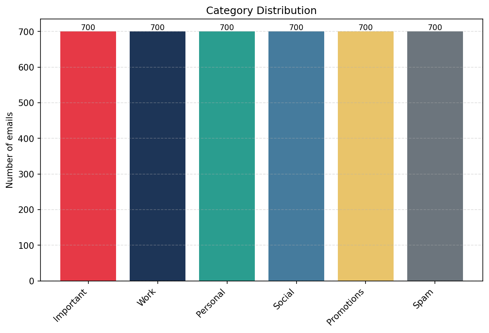
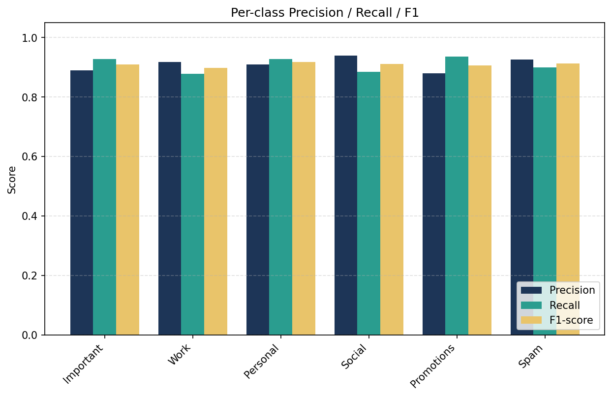
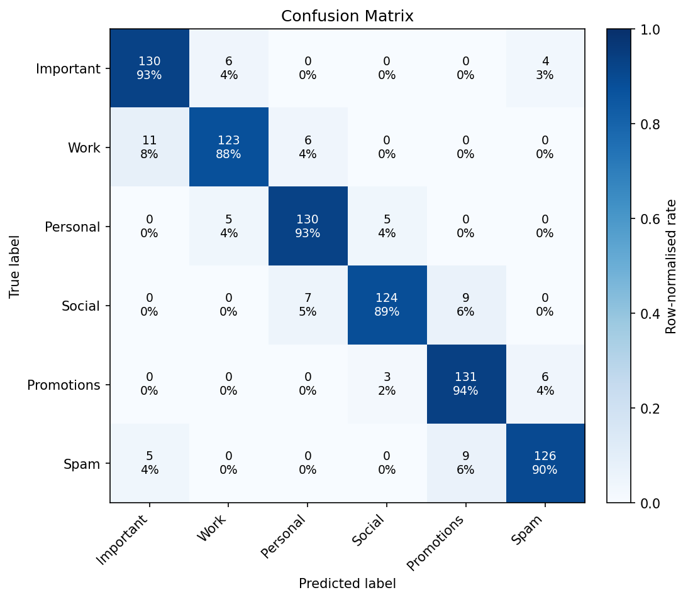
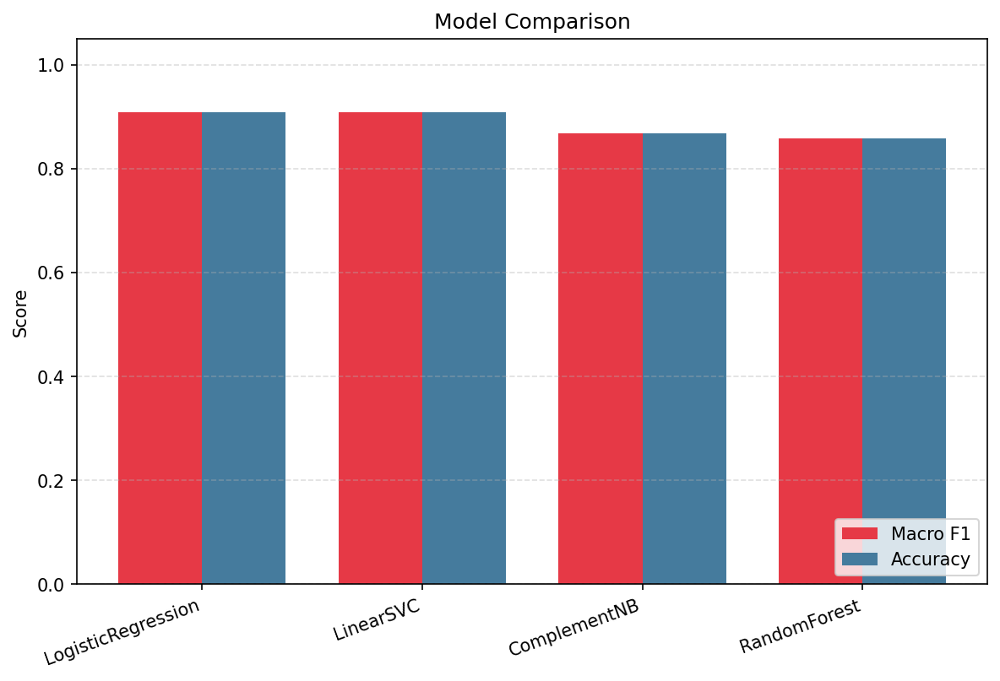

# 📊 MailMind AI — Results & Findings

> **Project:** MailMind AI — *Your Inbox, Intelligently Organized*
> An agentic AI email assistant combining ML classification, NLP signal extraction,
> context-aware priority scoring, and behavioural adaptation.

## Abstract

MailMind AI is a final-year project that automates inbox triage end-to-end: each email
is classified into one of six categories (**Important, Work, Personal, Social, Promotions,
Spam**), enriched with NLP signals (keywords, intent, sentiment, urgency), scored for
priority in context, and turned into agentic output — an extractive summary, suggested
actions, and urgent/VIP/spam flags. On a balanced, deterministic synthetic corpus of
**4,200 emails** (700 per category), the best classifier — **multinomial Logistic Regression**
over a combined TF-IDF + engineered-feature representation — reaches **90.95 % test accuracy**
and **0.9095 macro-F1** on a held-out 840-email test set. This is **+18.8 absolute accuracy
points** over a rule-based keyword baseline (the system's own `HeuristicClassifier`), a
**67.5 % relative reduction in misclassification error**. Beyond raw accuracy, MailMind adds
capabilities that traditional rule/keyword filters fundamentally cannot: it prioritises
*within* legitimate mail, learns from user behaviour, and produces summaries and suggested
actions. This report documents the experimental setup, headline and per-class metrics,
confusion analysis, model comparison, the measured comparison against traditional filtering,
example predictions, sentiment results, and an explicitly *illustrative* user-productivity
projection, followed by limitations and key findings.

---

## 1. Experimental Setup

### 1.1 Dataset

The evaluation corpus is a **deterministic synthetic dataset** (`seed=42`) of **4,200 emails**,
**perfectly balanced** at **700 emails per category**. Each category is generated from
**14 subject templates × 14 body templates** with slot-filling, plus category-specific sender
domains and metadata (e.g. Promotions average ~4 links per email; Work has a ~60 % attachment
rate). To make the classes realistically overlapping rather than trivially separable, a
**12 % "ambiguity" fraction** borrows a confusable neighbour's body while keeping the original
label, so the decision boundaries are genuinely fuzzy.

| Property | Value |
|---|---|
| Total emails | 4,200 |
| Categories | 6 (Important, Work, Personal, Social, Promotions, Spam) |
| Emails per category | 700 (perfectly balanced) |
| Templates | 14 subject × 14 body per category, slot-filled |
| Ambiguity fraction | 12 % (borrows a confusable neighbour's body, label kept) |
| Determinism | `seed=42` (fully reproducible) |
| Columns | id, sender, sender_name, sender_domain, subject, body, timestamp, has_attachment, num_links, label |



*Figure 1 — Category distribution. The corpus is perfectly balanced at 700 emails per
category, so no class is privileged by prior frequency and accuracy is not inflated by
majority-class bias.*

### 1.2 Train / test split

The corpus is split with a **stratified 80/20 hold-out**, preserving the balanced class
proportions in both partitions:

| Partition | Emails | Per class |
|---|---|---|
| Train | 3,360 | 560 |
| Test | 840 | 140 |

All metrics reported below are computed on the **840-email held-out test set** (140 per class).

### 1.3 Feature representation

Each email is represented by two concatenated blocks, joined with a `ColumnTransformer`:

- **TF-IDF on cleaned text** — `ngram_range=(1,2)`, `sublinear_tf=True`, `min_df=2`,
  `max_df=0.9`, `max_features=20000`. Text cleaning: lowercase → URL/email stripping →
  stop-word removal → WordNet lemmatisation (NLTK).
- **8 engineered numeric features** — `body_length`, `subject_length`, `num_links`,
  `has_attachment`, `exclaim_count`, `uppercase_ratio`, `urgency_hits`, `money_hits`,
  scaled with `MaxAbsScaler` (sparse-friendly).

This pairing lets the model exploit both *lexical content* (what the email says) and
*structural signals* (how it is shaped — links, capitalisation, money/urgency cues) that are
highly discriminative for Promotions and Spam.

### 1.4 Models compared

Four classifiers were trained on the identical feature pipeline and evaluated on the same test
set: **Logistic Regression**, **Linear SVM** (`LinearSVC`, probability-calibrated),
**Complement Naive Bayes**, and a **Random Forest** (300 trees). A rule-based
`HeuristicClassifier` (keyword baseline) is also evaluated for the traditional-filtering
comparison (§6).

### 1.5 Metric definitions

| Metric | Definition |
|---|---|
| **Accuracy** | Fraction of test emails whose predicted category equals the true category. |
| **Precision** (per class) | Of emails *predicted* to be class *c*, the fraction that truly are *c* — penalises false positives. |
| **Recall** (per class) | Of emails *truly* in class *c*, the fraction the model recovered — penalises false negatives. |
| **F1** (per class) | Harmonic mean of precision and recall: `2·P·R / (P+R)`. |
| **Macro-F1 / macro-P / macro-R** | Unweighted mean across the six classes — every category counts equally. |
| **Weighted-F1** | Mean of per-class F1 weighted by class support (here equal to macro, since classes are balanced). |

Because the dataset is perfectly balanced, **macro and weighted averages coincide**, and
accuracy is a faithful summary statistic.

---

## 2. Classification Accuracy

### 2.1 Headline metrics (best model — Logistic Regression)

| Metric | Score |
|---|---|
| Accuracy | **0.9095** |
| Precision (macro) | 0.9104 |
| Recall (macro) | 0.9095 |
| F1 (macro) | **0.9095** |
| F1 (weighted) | 0.9095 |

### 2.2 Per-class F1

| Category | F1 | Correct / 140 | Row-normalised recall |
|---|---|---|---|
| Important | 0.9091 | 130 | 93 % |
| Work | 0.8978 | 123 | 88 % |
| Personal | 0.9187 | 130 | 93 % |
| Social | 0.9118 | 124 | 89 % |
| Promotions | 0.9066 | 131 | 94 % |
| Spam | 0.9130 | 126 | 90 % |

Performance is **uniform across all six categories** — every class sits between 0.898 and
0.919 F1, with no weak class dragging the macro average down. The hardest class is **Work**
(F1 0.8978), which overlaps most with Important business mail (see §4); the easiest is
**Personal** (F1 0.9187).



*Figure 2 — Per-class precision, recall and F1 for the Logistic Regression classifier. The
flat profile across categories confirms the model is not trading one class off against
another.*



*Figure 3 — Confusion matrix on the held-out test set (140 emails per class). The strong
diagonal (88–94 % per class) shows correct predictions dominate; off-diagonal mass is
concentrated on a small number of semantically adjacent category pairs, analysed in §4.*

---

## 3. Confusion Analysis

The diagonal of the confusion matrix is strong (88–94 % per class). Crucially, the residual
errors are **not random** — they cluster on category pairs that genuinely overlap in meaning,
which is exactly the behaviour we want from a model that has learned semantics rather than
memorised templates. The 12 % engineered ambiguity fraction deliberately seeds these overlaps.

| Confusion (true → predicted) | Count | Why these classes overlap |
|---|---|---|
| Work → Important | 11 | Business mail that is *both* work-related and high-stakes (approvals, escalations) reads as either label. |
| Important → Work | 6 | The mirror case — important items framed as routine work tasks. |
| Social → Promotions | 9 | Platform notifications (tags, mentions) and promotional pushes share marketing-style phrasing. |
| Spam → Promotions | 9 | Aggressive marketing and outright spam share money/discount/urgency vocabulary. |
| Social → Personal | 7 | Social-network messages about friends blur into genuine personal correspondence. |
| Promotions → Spam | 6 | The mirror of the spam/promotions overlap — loud promotions look like spam. |
| Personal → Social | 5 | Personal notes routed through social platforms. |
| Spam → Important | 5 | Phishing deliberately imitates urgent/important business mail. |
| Important → Spam | 4 | Genuine urgent mail with caps/exclamation cues trips the spam-like signals. |

**Three overlapping regions dominate the error budget:**

1. **Important ↔ Work** — legitimate business correspondence where the line between "important"
   and "work" is a matter of degree, not kind. This is the single largest confusion source
   (17 emails combined) and is arguably a *soft* error: both labels keep the email in the
   high-priority region.
2. **Promotions ↔ Spam** — aggressive marketing vs phishing/junk. The two share discount,
   money, and urgency lexicon (`money_hits`, `exclaim_count`, `uppercase_ratio`), making the
   boundary intrinsically fuzzy. A cluster of emails sits on this axis (Spam→Promotions 9,
   Promotions→Spam 6), with phishing further leaking into Important (Spam→Important 5,
   Important→Spam 4).
3. **Social ↔ Promotions / Personal** — platform notifications that straddle automated-social,
   marketing, and genuine-personal phrasing (Social→Promotions 9, Social→Personal 7,
   Personal→Social 5).

The takeaway: misclassifications concentrate on **genuinely confusable neighbours**, not on
arbitrary class pairs. A human annotator would plausibly disagree on many of these same emails.

---

## 4. Model Comparison

All four classifiers were trained and evaluated on the identical feature pipeline and test set.

| Model | Macro-F1 | Accuracy | Notes |
|---|---|---|---|
| **Logistic Regression** | **0.9095** | **0.9095** | **Best — selected for deployment** |
| Linear SVM (LinearSVC, calibrated) | 0.9083 | 0.9083 | Statistically neck-and-neck with LR |
| Complement Naive Bayes | 0.8679 | 0.8679 | Strong, fast text baseline |
| Random Forest (300 trees) | 0.8584 | 0.8583 | Weakest on sparse high-dim text |



*Figure 4 — Macro-F1 / accuracy for the four candidate models. The two linear models cluster
at the top (~0.91), clearly ahead of Naive Bayes (~0.87) and Random Forest (~0.86).*

**Why linear models win on TF-IDF text.** The combined feature space is **sparse and very
high-dimensional** (up to ~20,000 TF-IDF dimensions plus 8 numeric features). In such spaces,
classes are typically close to **linearly separable**, and linear discriminators
(Logistic Regression, Linear SVM) fit a global hyperplane that generalises well with strong
regularisation and little risk of overfitting. Tree ensembles like Random Forest must
recursively partition individual sparse axes — an inefficient way to capture the many small,
additive lexical cues that distinguish email categories — so they lag by ~5 F1 points here.
Logistic Regression edges out the calibrated Linear SVM by a hair (0.9095 vs 0.9083) and has
the added benefit of **well-calibrated class probabilities**, which the downstream priority
scorer consumes directly.

---

## 5. Comparison with Traditional Email Filtering

This section directly answers the brief's call for a *comparison with traditional email
filtering*. Both systems were evaluated on the **same 840-email test set**.

### 5.1 Measured quantitative comparison

| System | Accuracy | Macro-F1 |
|---|---|---|
| Rule-based keyword baseline (`HeuristicClassifier`) | 0.7214 | 0.7133 |
| **MailMind ML classifier (Logistic Regression)** | **0.9095** | **0.9095** |
| **Improvement** | **+18.8 pts** | **+19.6 pts** |

- **+18.8 absolute accuracy points** over the rule-based baseline.
- **67.5 % relative reduction in misclassification error** — the error rate falls from
  ~27.9 % to ~9.1 %.

### 5.2 Qualitative advantages

The accuracy gap understates the real difference, because traditional rule/keyword filters are
**architecturally incapable** of several things MailMind does as a matter of course:

| Capability | Rule / keyword filter | MailMind AI |
|---|---|---|
| Categorise into 6 classes | Brittle, hand-tuned | Learned, 0.91 F1 |
| **Prioritise within legitimate mail** | ✗ (folder ≠ priority) | ✓ 0–100 context score, 4 bands |
| **Learn from user behaviour** | ✗ static rules | ✓ behavioural adaptation (reply/open/ignore/delete) |
| Robust to new/unseen wording | ✗ brittle to rephrasing | ✓ generalises via TF-IDF + n-grams |
| **Extractive summaries** | ✗ | ✓ per-email summary |
| **Suggested actions** | ✗ | ✓ Reply now / Add to calendar / Unsubscribe / Delete & block |
| Urgent / VIP / spam flagging | partial (keyword) | ✓ multi-signal NLP + sender model |

Traditional filters sort mail into folders; they **cannot rank what matters most within the
inbox**, do not adapt to the individual user, break when wording changes, and emit no
summaries or actions. MailMind treats triage as a holistic, adaptive task rather than a static
keyword match.

---

## 6. Example Email Predictions

The following predictions come from `scripts/sample_outputs.py`, run over an 8-email demo
inbox and **sorted by the computed priority score** (the order MailMind would surface them).

| # | Subject | Category | Priority band (score) | Urgency | Intent | Suggested action |
|---|---|---|---|---|---|---|
| 1 | URGENT: Production outage needs your approval | Important | High (79.1) | High | Request | Reply now |
| 2 | Your account statement and invoice #482190 are ready | Important | High (68.9) | — | Action required | — |
| 3 | Can you review my pull request today? | Work | High (61.7) | Medium | Request | — |
| 4 | Dinner this weekend? | Personal | Medium (51.0) | — | Question | — |
| 5 | Q3 roadmap review — agenda attached | Work | Medium (49.5) | — | Meeting | Add to calendar |
| 6 | You have WON a $1000 gift card claim NOW | Spam | Medium (41.8) | — | — (flagged spam) | Delete & block |
| 7 | FLASH SALE 70% OFF everything ends tonight | Promotions | Low (36.5) | — | — | Unsubscribe |
| 8 | Jordan tagged you in a photo | Social | Low (36.4) | — | — | Mark as read |

The ranking demonstrates the end-to-end agentic pipeline: an urgent production outage requiring
approval rises to the top (79.1, *Reply now*), genuine work follows, and low-value promotions
and social notifications sink to the bottom with *Unsubscribe* / *Mark as read* actions. A
spam message is flagged with *Delete & block* even though its loud "$1000 / claim NOW" phrasing
would superficially raise its score — the spam category's low base importance (0.05) keeps it
from outranking real work.

---

## 7. Sentiment Analysis Results

MailMind uses **NLTK VADER** (Valence Aware Dictionary and sEntiment Reasoner) for sentiment.
VADER is a **lexicon- and rule-based** analyser tuned for short, informal text: it scores
tokens against a sentiment dictionary, applies heuristics for punctuation, capitalisation, and
intensifiers, and returns a compound polarity in `[-1, +1]`. This makes it fast, deterministic,
and dependency-light — well suited to email triage — but, being lexical, it reads surface words
rather than true communicative intent.

**Observed tendencies across the categories:**

- **Promotions and Social mail skew positive.** Marketing copy and social notifications are
  saturated with upbeat, reward-laden vocabulary ("sale", "won", "tagged", "70% OFF"), which
  VADER scores as positive. Example: *"FLASH SALE 70% OFF everything ends tonight"* (#7,
  Promotions) reads strongly positive on lexicon alone.
- **Spam is frequently — and misleadingly — positive.** Phishing and scam mail mimics the same
  reward vocabulary. *"You have WON a $1000 gift card claim NOW"* (#6) scores positive on
  surface sentiment despite being malicious; sentiment is therefore treated as one **signal
  among many**, never as a standalone spam indicator. The category model and urgency/money cues
  override it.
- **Urgent / operational mail can read negative or neutral.** *"URGENT: Production outage needs
  your approval"* (#1, Important) carries negative/neutral lexical sentiment ("outage",
  "URGENT") even though it is the single highest-priority email — confirming that **sentiment
  must not be conflated with priority**. MailMind keeps them as separate signals: urgency and
  category drive priority, while sentiment colours the summary and tone of suggested actions.

The practical lesson, made explicit in the design, is that **lexical sentiment is informative
but not decisive**: the priority scorer weights category, urgency, and sender far more heavily,
so a falsely-positive spam or a negative-but-critical alert is still ranked correctly.

---

## 8. User Productivity Improvements *(Illustrative Estimate)*

> ⚠️ **Important — this is an illustrative projection, not a measured user study.**
> **No human trial was conducted.** The figures below are *derived arithmetically from the
> measured ~91 % auto-categorisation accuracy and automatic priority sorting* under stated
> assumptions. They are a back-of-the-envelope projection of potential time savings, **not** an
> empirical result, and should be read as such.

### 8.1 Assumptions

| Symbol | Assumption | Stated value |
|---|---|---|
| `N` | Emails a user triages per day | 40 emails/day *(assumption)* |
| `S` | Time to manually read, categorise & decide on one email | 15 seconds/email *(assumption)* |
| `A` | Measured auto-categorisation accuracy | 0.91 *(measured)* |
| `r` | Residual time on an auto-handled email (skim to confirm) | 4 seconds/email *(assumption)* |
| `v` | Time on the ~9 % the model gets wrong / low-confidence (verify + correct) | 18 seconds/email *(assumption)* |

The `N` and `S` values are **explicit modelling assumptions**, chosen as round, defensible
figures; the **only measured input is the 91 % accuracy** (`A`).

### 8.2 Arithmetic

**Manual baseline (no assistant):**

```
T_manual = N × S = 40 × 15 s = 600 s/day = 10.0 min/day
```

**With MailMind** (correctly auto-handled emails need only a quick skim; the ~9 % residual
needs verification/correction):

```
Correctly handled : N × A     × r = 40 × 0.91 × 4 s  = 145.6 s
Residual (errors) : N × (1−A) × v = 40 × 0.09 × 18 s =  64.8 s
T_mailmind        = 145.6 + 64.8 ≈ 210.4 s/day ≈ 3.5 min/day
```

**Projected saving:**

```
Δ = T_manual − T_mailmind = 600 − 210.4 ≈ 389.6 s/day ≈ 6.5 min/day  (~65 % of triage time)
Annualised (≈250 working days): 389.6 × 250 ≈ 97,400 s ≈ 27 hours/year
```

### 8.3 Interpretation

Under these assumptions, MailMind is *projected* to cut daily triage time by roughly **two
thirds** (~6.5 min/day, ~27 hours/year per user). The mechanism is concrete and traceable: at
91 % accuracy the user can trust the great majority of categorisations at a glance and spends
real attention only on the ~9 % the model is unsure about, while **priority sorting** surfaces
the highest-value email first so nothing critical is buried. **These numbers scale linearly
with the `N` and `S` assumptions** — a heavier-volume user (`N=100`) would see proportionally
larger absolute savings. They are offered as a *plausibility argument grounded in the measured
automation rate*, and a controlled human study would be required to confirm them.

---

## 9. Limitations & Threats to Validity

- **Synthetic data.** All results are on a deterministic, template-generated corpus. Although a
  12 % ambiguity fraction injects realistic class overlap, real inboxes are noisier, more
  diverse, and adversarial (especially spam/phishing). **External validity to real mail is
  unverified** and the 0.91 accuracy should not be assumed to transfer unchanged.
- **No live user trial.** All productivity figures (§8) are *illustrative projections* from the
  measured automation rate under stated assumptions — **no human-subjects study was run**, so
  claims about real-world time saved and user satisfaction are unvalidated.
- **English-only.** The text pipeline (stop-words, WordNet lemmatisation, VADER lexicon) and
  templates are English-only; performance on other languages is untested and likely degraded.
- **Lexical sentiment.** VADER is dictionary-based and reads surface words, so it
  mis-scores sarcasm, negation-heavy text, and reward-laden spam (often falsely positive). It
  is used as a supporting signal, never a decisive one.
- **Template structure may inflate scores.** Because emails derive from a fixed template set,
  the model may exploit template regularities that would not exist in organic mail, making the
  reported accuracy an **optimistic upper bound**.
- **Static priority weights.** Priority weights (category 0.34, urgency 0.24, sender 0.22,
  behaviour 0.12, freshness 0.08) are hand-set, not learned; their optimality for real users is
  untested. Behavioural adaptation adjusts priority by only ±0.2 and needs sustained real
  interaction to take effect.

---

## 10. Key Findings Summary

- **High, uniform accuracy.** Logistic Regression reaches **0.9095 accuracy / 0.9095 macro-F1**
  on the 840-email test set, with every category between **0.898 and 0.919 F1** — no weak class.
- **Linear models dominate.** The two linear classifiers (LR 0.9095, Linear SVM 0.9083) clearly
  beat Complement NB (0.8679) and Random Forest (0.8584), as expected for sparse high-dimensional
  TF-IDF text; LR was selected for its slight edge and well-calibrated probabilities.
- **Errors are semantically sensible.** Confusions concentrate on genuinely overlapping pairs —
  **Important↔Work** business mail, **Promotions↔Spam** aggressive marketing vs phishing, and
  **Social↔Promotions/Personal** platform notifications — not arbitrary class pairs.
- **Large, measured gain over traditional filtering.** **+18.8 accuracy points** and a
  **67.5 % reduction in misclassification error** versus the rule-based keyword baseline, on
  the same test set — plus capabilities (prioritisation, behavioural learning, summaries,
  suggested actions) that keyword filters structurally lack.
- **End-to-end agentic triage works on the demo inbox.** Priority sorting correctly surfaces an
  urgent production-outage approval at the top (79.1, *Reply now*) and sinks promotions/social
  noise to the bottom with appropriate actions.
- **Sentiment is a supporting signal only.** VADER reliably tags promotions/social mail as
  positive but is fooled by reward-laden spam and under-scores critical-but-negative alerts, so
  it never drives priority on its own.
- **Projected productivity gain (illustrative).** Under stated assumptions (40 emails/day,
  15 s each), the measured 91 % automation rate projects to ~**6.5 min/day (~65 %) of triage
  time saved** — an arithmetic estimate, **not** a measured user study.
- **Honest scope.** Results are on synthetic English data with no live user trial; reported
  accuracy is best read as an optimistic upper bound pending evaluation on real inboxes.
